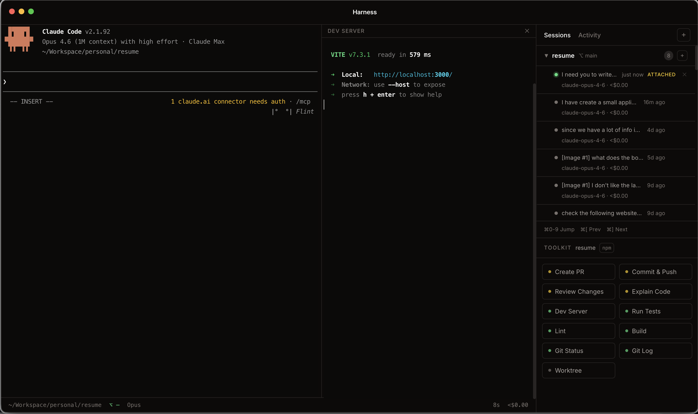

# Harness

Desktop manager for Claude Code. Discover sessions, resume conversations, run commands -- all from one window.



## Install

```bash
curl -fsSL https://raw.githubusercontent.com/magidmroueh/harness/main/install.sh | bash
```

Downloads the latest release, mounts the DMG, and copies Harness to `/Applications`. Supports both Apple Silicon and Intel Macs.

Or download the DMG directly from [Releases](https://github.com/magidmroueh/harness/releases).

**Requirements:** macOS 14+ and [Claude Code CLI](https://docs.anthropic.com/en/docs/claude-code) (`claude` in your PATH).

### Updates

Harness checks for updates automatically on launch (and every 4 hours). When a new version is available, a banner appears at the top of the app. You can also check manually from the Toolkit.

To update via terminal:

```bash
curl -fsSL https://raw.githubusercontent.com/magidmroueh/harness/main/install.sh | bash
```

## What This Is

Every time you run `claude` in a terminal, it creates a session file in `~/.claude/`. Harness reads those files, groups them by project, and gives you a UI to manage everything:

- Click a past session to resume it in an embedded terminal
- Start fresh sessions in any project
- Run tests, builds, dev servers in a split pane (auto-detects npm/yarn/pnpm/bun)
- Manage git worktrees for parallel work
- Send Claude commands from the toolkit (create PR, commit, review code, show changes)
- Get notified when Claude finishes or needs input (badges, desktop notifications, sound)
- Search and filter sessions with Cmd+F
- Toggle light/dark theme

## How It Works

```
~/.claude/
├── sessions/          Harness reads these to find running Claude processes
│   └── {PID}.json       { pid, sessionId, cwd, startedAt }
└── projects/          Harness reads these for conversation history
    └── {slug}/
        └── {id}.jsonl   First user message becomes the session label
```

The app polls every 5 seconds (via TanStack Query), detects which PIDs are alive, and merges running + past sessions into the sidebar.

## Keyboard Shortcuts

| Key | Action |
|-----|--------|
| `Cmd+J` | Toggle bottom terminal panel |
| `Cmd+F` | Search / filter sessions |
| `Cmd+1` -- `Cmd+9` | Jump to terminal by index |
| `Cmd+[` | Previous terminal |
| `Cmd+]` | Next terminal |

---

## Development

```bash
git clone https://github.com/magidmroueh/harness.git
cd harness
bun install
bun run rebuild    # rebuild native modules (node-pty) for Electron
bun run dev        # dev mode with HMR
```

### Scripts

| Script | What it does |
|--------|-------------|
| `bun run dev` | Dev mode with hot reload |
| `bun run build` | Production build |
| `bun run start` | Run production build |
| `bun run rebuild` | Rebuild native modules for Electron |
| `bun run pack` | Package .app locally (no installer) |
| `bun run dist` | Build DMG + ZIP for distribution |
| `bun run lint` | Run oxlint |
| `bun run fmt` | Format with oxfmt |

### Architecture

```
Electron main process          Renderer (React)
┌─────────────────────┐        ┌──────────────────────────────┐
│ node-pty (PTY mgmt) │◄──IPC──►│ xterm.js + WebGL (terminal) │
│ SessionManager      │◄──IPC──►│ TanStack Query (sessions)   │
│ WorktreeManager     │◄──IPC──►│ React components (UI)       │
│ AttentionDetector   │◄──IPC──►│ Notification system         │
│ Updater             │◄──IPC──►│ Update banner               │
└─────────────────────┘        └──────────────────────────────┘
```

### Stack

| Layer | Choice |
|-------|--------|
| Runtime | Electron 32 (frameless macOS window) |
| UI | React 18 + TypeScript |
| Data | TanStack Query (polling, cache, optimistic updates) |
| Terminal | xterm.js + WebGL addon + node-pty |
| Icons | Animated Lucide icons via motion/react |
| Build | electron-vite + electron-builder |
| Package manager | Bun |
| Linting | oxlint + oxfmt |
| Styling | CSS custom properties (no framework) |

### Releasing

Releases are automated. Every push to `main` triggers a GitHub Actions workflow that:

1. Builds the app
2. Packages DMG + ZIP for macOS
3. Creates a GitHub Release with the artifacts

To bump the version before merging:

```bash
# Edit version in package.json, then merge to main
```

### Project Layout

```
src/
├── main/
│   ├── index.ts           IPC handlers, PTY spawn, window setup
│   ├── sessions.ts        Read ~/.claude/, detect package managers
│   ├── worktrees.ts       git worktree list/create/remove
│   ├── notifications.ts   Terminal attention detection (idle + patterns)
│   └── updater.ts         GitHub release version checker
├── preload/
│   ├── index.ts           contextBridge API
│   └── index.d.ts         TypeScript types for window.api
└── renderer/
    └── src/
        ├── App.tsx         Layout, terminal + split pane state
        ├── types.ts        Session, TerminalInstance, ToolkitAction
        ├── tokens.css      Design tokens (stone palette, dark/light)
        ├── hooks/
        │   ├── useSessions.ts       TanStack Query hooks
        │   ├── useTheme.ts          Dark/light toggle
        │   ├── useNotifications.ts  Attention event state
        │   └── useNotificationSound.ts  Audio chime
        └── components/
            ├── SessionPanel.tsx     Accordion by project, session list, search
            ├── TerminalView.tsx     xterm.js + PTY bridge, theme + Nerd Font support
            ├── BottomTerminal.tsx   Tabbed general-purpose terminal panel
            ├── Toolkit.tsx          Grouped action grid (claude + shell + tools)
            ├── ToolkitAction.tsx    Single action with animated icon
            ├── WorktreePanel.tsx    Git worktree overlay
            ├── NotificationPanel.tsx Notification list
            ├── UpdateBanner.tsx     Update notification banner
            ├── StatusBar.tsx        cwd, git branch (live), model, terminal toggle
            ├── TitleBar.tsx         Logo, title, theme toggle
            ├── NewSessionDialog.tsx Folder picker
            └── icons/              Animated Lucide icons (motion/react)
```

## License

MIT
